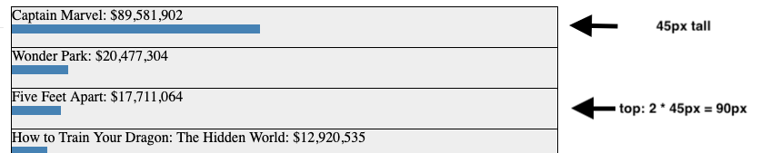

# Creating an animated bar chart with D3.js

## Overview

This repository provides an example of how to created a bar chart that
shows how the relative rank of things changes over time. The data
chosen for this example is box office revenue over three weeks.

## CSS



I wanted to animated the movies moving up and down the chart as their
relative ranks changed. The `top` CSS property works for this purpose
because it is an [animatable property](https://developer.mozilla.org/en-US/docs/Web/CSS/CSS_animated_properties)

To use the `top` property I made the `div` have a `position` of
`absolute`. Also the containing `div` must have a `position` of
`relative`.

https://developer.mozilla.org/en-US/docs/Web/CSS/top

```
When position is set to absolute or fixed, the top property specifies
the distance between the element's top edge and the top edge of its
containing block. (Containing block needs to have property position:
relative)
```

This results in the following layout:

- body
  - .chart (position: relative)
    - div (position: absolute) (dynamically created)
    - div (position: absolute) (dynamically created)
    - . . .

## Data

The data is organized as an array of objects, where each object
represents the top ten grossing movies for a week.

The displayRevenue field is stored to avoid calculating it every time.

```
// Three weeks of top ten grossing movies
const data = [
    {
        "daterange":"March 1-7, 2019",
        "movies":[
            {"name":"How to Train Your Dragon: The Hidden World", "revenue":37315850, "displayRevenue": "$37,315,850"},
            {"name":"Tyler Perry's A Madea Family Funeral", "revenue":33829810, "displayRevenue": "$33,829,810"},
            {"name":"Alita: Battle Angel", "revenue":9914756, "displayRevenue": "$9,914,756"},
            {"name":"The LEGO Movie 2: The Second Part", "revenue":8224921, "displayRevenue": "$8,224,921"},
            {"name":"Green Book", "revenue":6442260, "displayRevenue": "$6,442,260"},
            {"name":"Fighting with My Family", "revenue":6213469, "displayRevenue": "$6,213,469"},
            {"name":"Greta", "revenue":6090735, "displayRevenue": "$6,090,735"},
            {"name":"Isn't It Romantic", "revenue":6090717, "displayRevenue": "$6,090,717"},
            {"name":"What Men Want", "revenue":3856156, "displayRevenue": "$3,856,156"},
            {"name":"Happy Death Day 2U", "revenue":3160035, "displayRevenue": "$3,160,035"},
        ]
    },
    {
        "daterange":"March 8-14, 2019",
        "movies":[
            {"name":"Captain Marvel", "revenue":196895933, "displayRevenue": "$196,895,933"},
            {"name":"How to Train Your Dragon: The Hidden World", "revenue":21332970, "displayRevenue": "$21,332,970"},
            {"name":"Tyler Perry's A Madea Family Funeral", "revenue":17153205, "displayRevenue": "$17,153,205"},
            {"name":"The LEGO Movie 2: The Second Part", "revenue":5899752, "displayRevenue": "$5,899,752"},
            {"name":"Alita: Battle Angel", "revenue":4775475, "displayRevenue": "$4,775,475"},
            {"name":"Green Book", "revenue":3691160, "displayRevenue": "$3,691,160"},
            {"name":"Isn't It Romantic", "revenue":3356720, "displayRevenue": "$3,356,720"},
            {"name":"Fighting with My Family", "revenue":3323683, "displayRevenue": "$3,323,683"},
            {"name":"Greta", "revenue":3238965, "displayRevenue": "$3,238,965"},
            {"name":"What Men Want", "revenue":1909856, "displayRevenue": "$1,909,856"},
        ]
    },
    {
        "daterange":"March 15-21, 2019",
        "movies":[
            {"name":"Captain Marvel", "revenue":89581902, "displayRevenue": "$89,581,902"},
            {"name":"Wonder Park", "revenue":20477304, "displayRevenue": "$20,477,304"},
            {"name":"Five Feet Apart", "revenue":17711064, "displayRevenue": "$17,711,064"},
            {"name":"How to Train Your Dragon: The Hidden World", "revenue":12920535, "displayRevenue": "$12,920,535"},
            {"name":"Tyler Perry's A Madea Family Funeral", "revenue":10398217, "displayRevenue": "$10,398,217"},
            {"name":"No Manches Frida 2", "revenue":4846279, "displayRevenue": "$4,846,279"},
            {"name":"Captive State", "revenue":4310660, "displayRevenue": "$4,310,660"},
            {"name":"The LEGO Movie 2: The Second Part", "revenue":3018837, "displayRevenue": "$3,018,837"},
            {"name":"Alita: Battle Angel", "revenue":2811511, "displayRevenue": "$2,811,511"},
            {"name":"Green Book", "revenue":1936925, "displayRevenue": "$1,936,925"},
        ]
    },
];
```

## Code

For each week the data can be split into four categories

### Exiting movies

Movies that were in the top ten for the previous week but not in the
current week fade out over 100 ms

```
// Fade out removed elements
chart.exit()
     .transition(100)
     .style("opacity", 0)
     .remove();
```

### Remaning movies

Movies that are in both the previous week and the current week are
animated to the current week's rank

```
// Animate remaining elements to new position
chart.transition()
     .delay(100)
     .style("top", elementTop);
```

### Entering movies

Movies that are new in the current week are placed at their rank

```
    // Set the position of new elements
    const elements = chart.enter()
                        .append("div")
                        .style("top", elementTop);
```

### Remaining and Entering movies

Both remaining and entering movies are displayed in the current week,
so display their name, revenue, and bar

```
// Get both new and remaining elements
const merged = elements.merge(chart);

// Show the movie name and revenue
merged.append("div")
      .text(d => d.name + ": " + currencyFormat(d.revenue, '$'));

// Go to the next week if there is one
merged.append("div")
      .attr("class", "bar")
      .style("width", d => horizontalScale(d.revenue) + "px");
```


## References

I used these articles by Mike Bostock as a guide:

[General Update Pattern, I](https://bl.ocks.org/mbostock/3808218)

[General Update Pattern, II](https://bl.ocks.org/mbostock/3808221)

[General Update Pattern, III](https://bl.ocks.org/mbostock/3808234)
